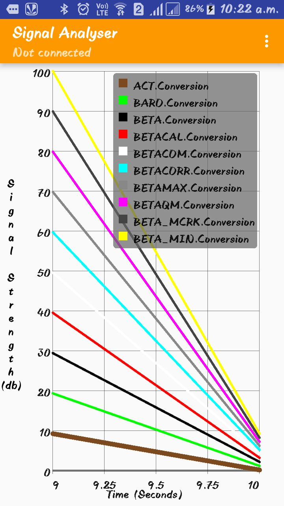
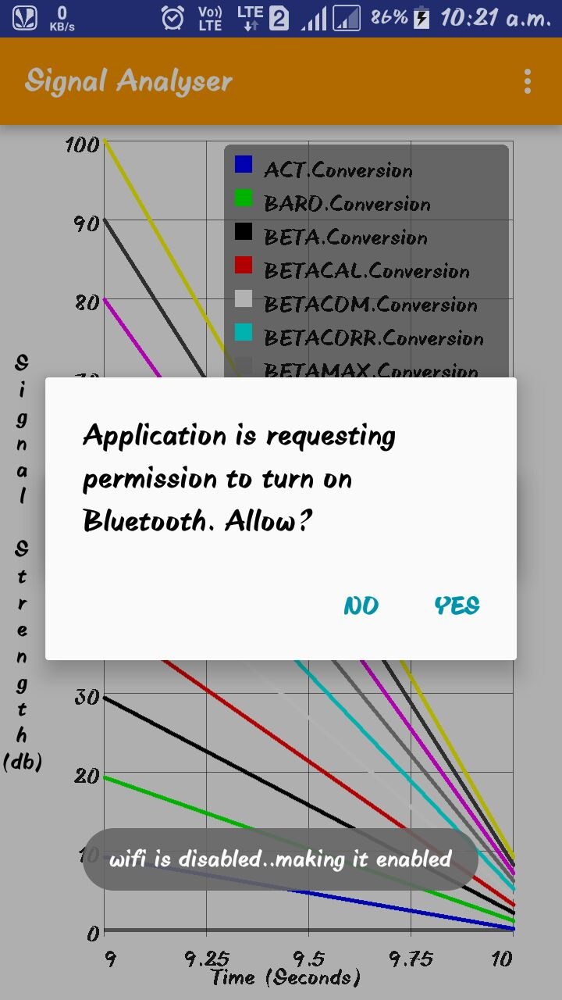
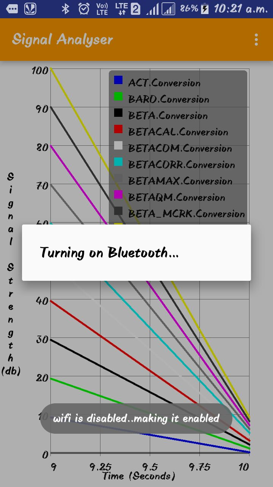
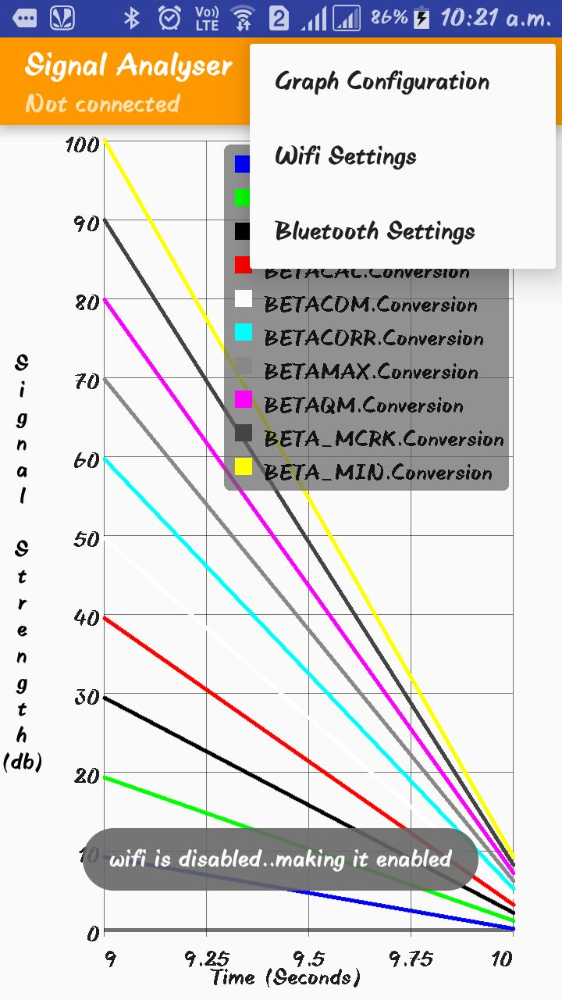
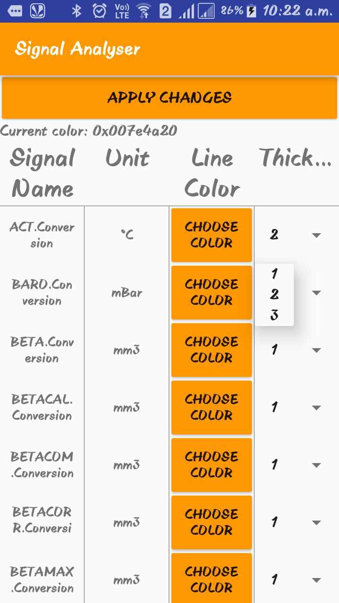
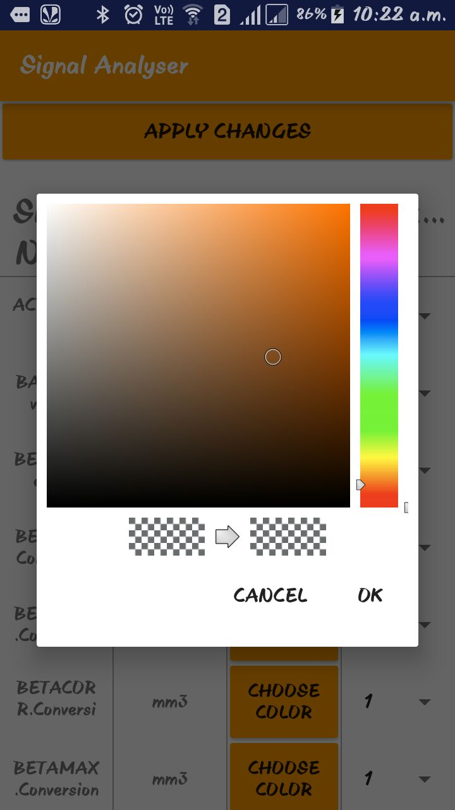
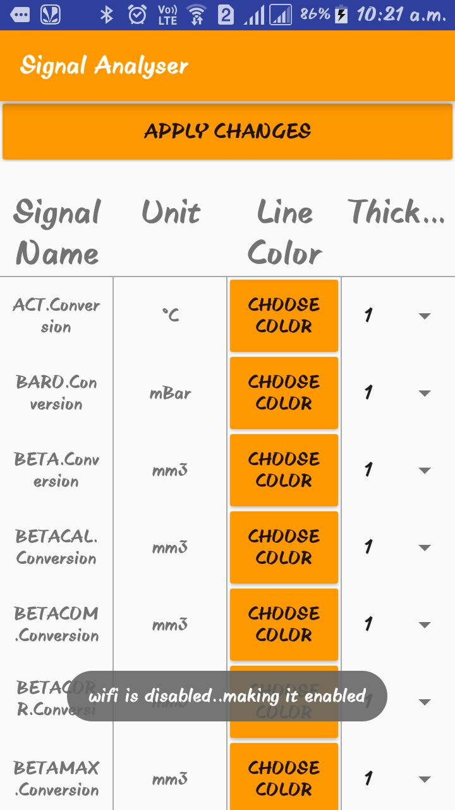

# SignalAnalyser
A customized graph plotting engine

## Getting started
<ul>
<li> Install android studio</li>
<li> clone this repo</li>
<li> Install ambilwarna library from: <a href = "https://github.com/yukuku/ambilwarna">Ambilwarna Lib</a>
<li> Rebuild project</li>
</ul>

## Details
<ul>
<li>This project aims to plot a given set of data making use of the ambilwarna library. </li>
<li>It can plot upto 10 lines with customization based on color and thickness, which helps in easy analysis of interdependent sensor data</li>
<li>Wifi and bluetooth connectivity options are given. Furthur customization of code can enable to plot data based on values received over bluetooth or wifi</li
</ul>

